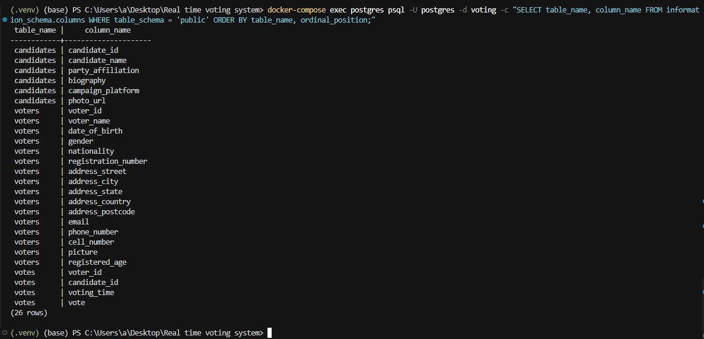
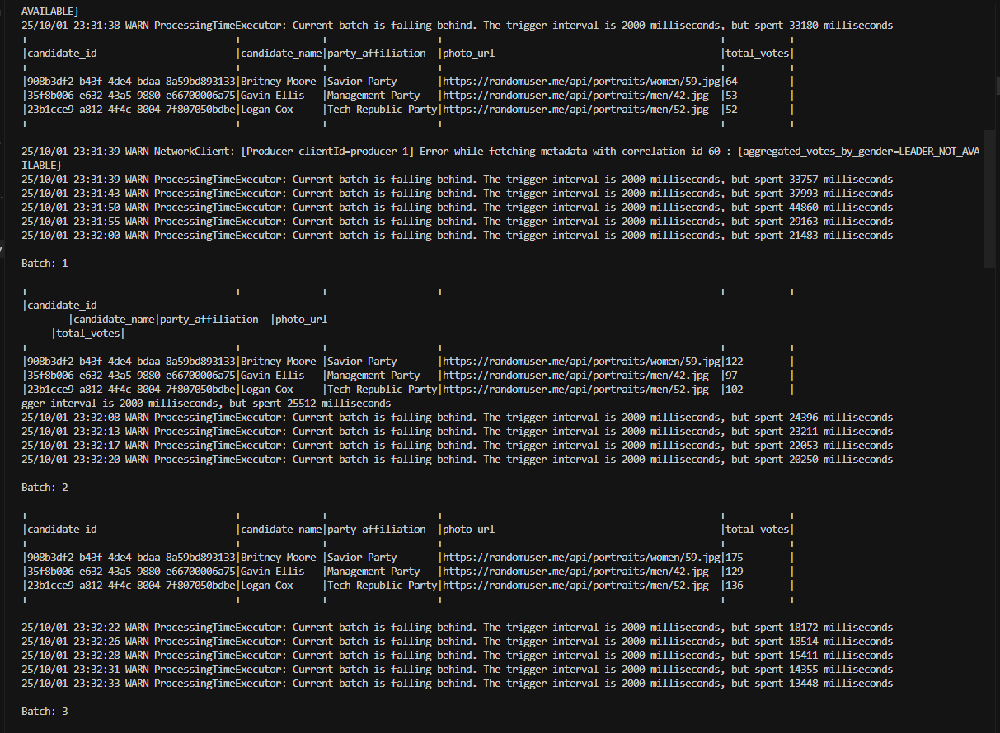
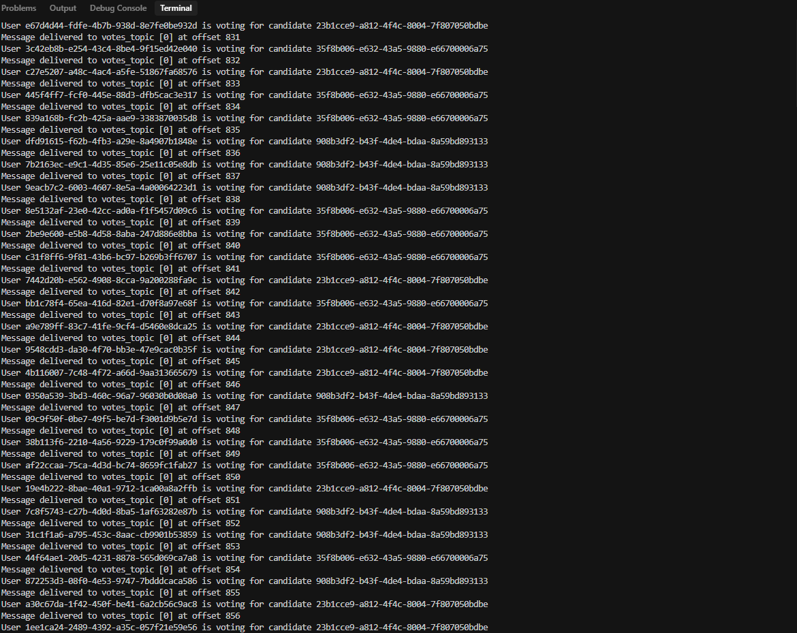
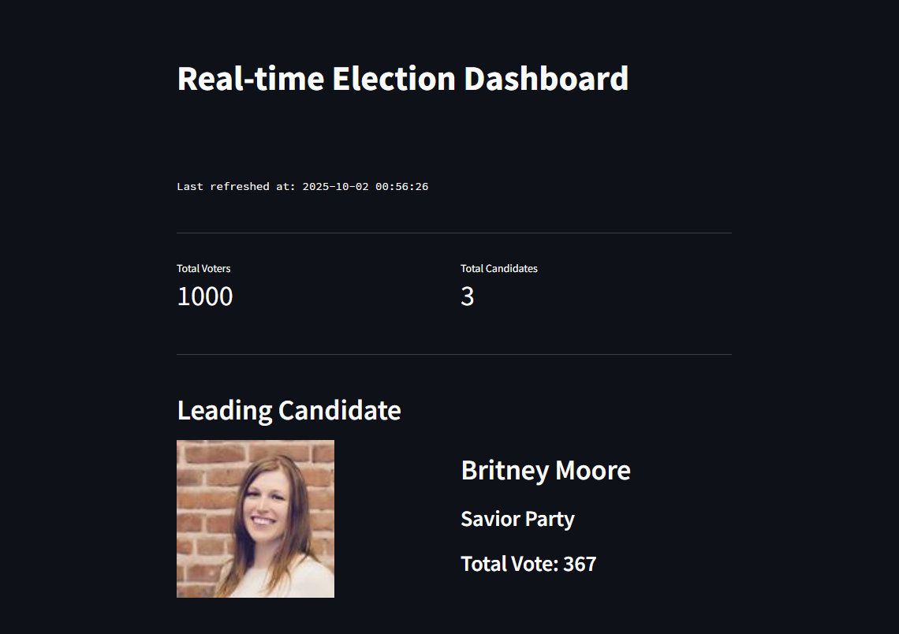
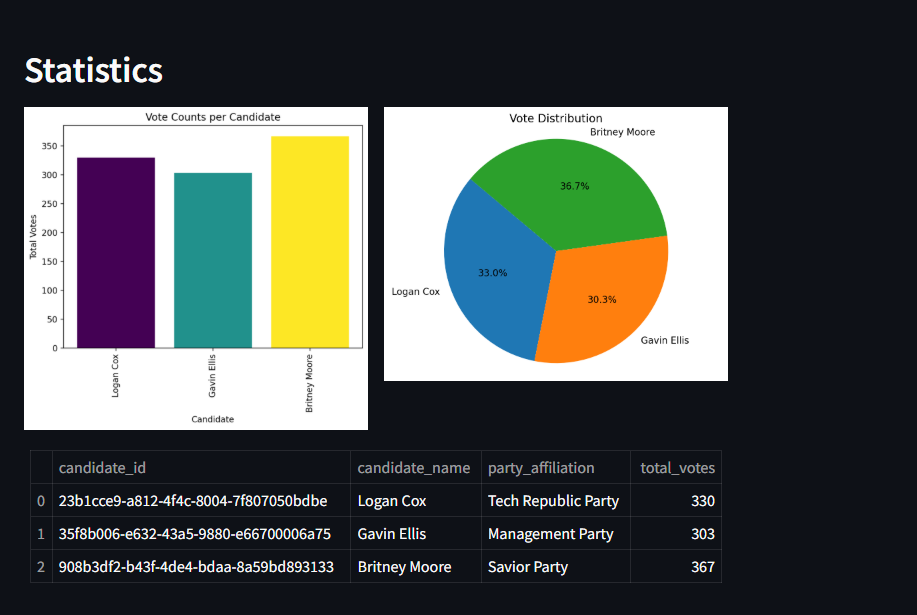

# Real-Time Voting System

A distributed voting platform that processes election data in real-time using modern streaming technologies. Built with Python, Apache Kafka, Spark Streaming, PostgreSQL, and Streamlit for live data visualization.

## Architecture Overview


## Core Components

**main.py**: Initializes the PostgreSQL database with candidate and voter tables, generates sample data, and streams voter registrations to Kafka topics for downstream processing.

**voting.py**: Processes incoming voter data from Kafka streams, simulates the voting process, and publishes vote events to dedicated Kafka topics for real-time analysis.

**spark-streaming.py**: Handles large-scale vote processing using Spark Streaming, performs data aggregations (by candidate, location, demographics), and streams results back to Kafka for dashboard consumption.

**streamlit-app.py**: Provides an interactive web dashboard that displays live voting statistics, candidate rankings, and demographic breakdowns by consuming data from both Kafka streams and PostgreSQL.

## Environment Setup

Deploy the complete infrastructure using Docker containers for Kafka, Zookeeper, PostgreSQL, and Spark cluster components.

### Requirements
- Python 3.9+ with pip package manager
- Docker Engine and Docker Compose
- Minimum 4GB RAM for optimal performance

### Infrastructure Deployment
1. Clone the project repository to your local machine
2. Open terminal in the project root directory  
3. Launch all services with Docker Compose:
```bash
docker-compose up -d
```
This starts the entire stack: Zookeeper, Kafka broker (port 29092), PostgreSQL database (port 5432), and Spark cluster in background mode.

## Application Execution

### Python Environment Setup
```bash
python -m venv .venv
.\.venv\Scripts\Activate.ps1
pip install -r requirements.txt
```

### Step-by-Step Execution

**1. Database Initialization & Voter Generation**
```bash
$env:KAFKA_BOOTSTRAP_SERVERS="localhost:29092"
python main.py
```

**2. Vote Processing Simulation**  
```bash
$env:KAFKA_BOOTSTRAP_SERVERS="localhost:29092"
python voting.py
```

**3. Real-Time Analytics with Spark**
```bash
docker-compose exec spark-master /opt/spark/bin/spark-submit --master spark://spark-master:7077 --packages org.apache.spark:spark-sql-kafka-0-10_2.12:3.5.0 /app/spark-streaming.py
```

**4. Launch Interactive Dashboard**
```bash
$env:KAFKA_BOOTSTRAP_SERVERS="localhost:29092"
streamlit run streamlit-app.py
```

Access the live dashboard at: http://localhost:8501

## Screenshots

### Database Schema


### Spark Streaming Batches


### Voting Process


### Dashboard



